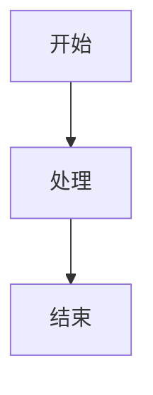

# 文档使用指南

## 推荐框架：MkDocs Material

本项目使用 **MkDocs Material** 作为文档框架，这是一个基于 Python 的现代化文档生成工具。

### 为什么选择 MkDocs Material？

✅ **简单易用**: 基于 Markdown，学习成本低  
✅ **现代化UI**: Material Design 主题，美观现代  
✅ **自动API生成**: 通过 `mkdocstrings` 自动从代码生成API文档  
✅ **易于部署**: 支持 GitHub Pages、Netlify 等  
✅ **功能丰富**: 搜索、代码高亮、数学公式、Mermaid图表等  
✅ **中文友好**: 完全支持中文内容  

## 快速开始

### 1. 安装依赖

```bash
pip install -r docs/requirements.txt
```

### 2. 本地预览

```bash
# 在项目根目录执行
mkdocs serve
```

然后在浏览器打开 `http://127.0.0.1:8000` 查看文档。

### 3. 构建文档

```bash
mkdocs build
```

生成的静态文件在 `site/` 目录。

## 文档结构

```
docs/
├── index.md                    # 首页
├── getting-started/            # 入门指南
│   ├── installation.md
│   └── quickstart.md
├── tutorials/                  # 教程
│   ├── index.md
│   ├── robot-control.md
│   ├── sensor-usage.md
│   └── policy-integration.md
├── api/                        # API文档（自动生成）
│   ├── index.md
│   ├── robot/
│   ├── controller/
│   ├── sensor/
│   ├── client/
│   └── common/
├── architecture/               # 架构文档
│   ├── overview.md
│   ├── robot-system.md
│   ├── controller-system.md
│   └── sensor-system.md
├── examples/                   # 示例说明
│   ├── robot-examples.md
│   └── pipeline-examples.md
├── contributing.md             # 贡献指南
└── README.md                  # 文档构建说明
```

## 编写文档

### 添加新页面

1. 在相应目录创建 `.md` 文件
2. 在 `mkdocs.yml` 的 `nav` 部分添加链接：

```yaml
nav:
  - 新章节:
    - 新页面: path/to/new-page.md
```

### API文档自动生成

在 `.md` 文件中使用以下语法自动生成API文档：

```markdown
::: xdeploy.module.Class
    options:
      show_root_heading: true
      show_source: true
      heading_level: 3
```

例如：

```markdown
# Robot类

::: xdeploy.robot.robot.Robot
    options:
      show_root_heading: true
      show_source: true
```

### Markdown扩展功能

MkDocs Material 支持丰富的 Markdown 扩展：

#### 代码块

````markdown
```python
def hello():
    print("Hello, World!")
```
````

#### 提示框

```markdown
!!! note "提示"
    这是一个提示信息。

!!! warning "警告"
    这是一个警告信息。

!!! tip "技巧"
    这是一个技巧提示。
```

#### 标签页

````markdown
=== "Python"
    ```python
    print("Hello")
    ```

=== "JavaScript"
    ```javascript
    console.log("Hello");
    ```
````

#### 数学公式

```markdown
$$
E = mc^2
$$
```

#### Mermaid 图表

````markdown

````

## 部署

### GitHub Pages

1. 安装 `mkdocs gh-deploy` 插件（已包含在依赖中）
2. 执行部署：

```bash
mkdocs gh-deploy
```

这会将文档部署到 `gh-pages` 分支。

### 其他平台

构建后上传 `site/` 目录到任何静态网站托管服务：
- Netlify
- Vercel
- 自建服务器

## 配置说明

主要配置文件：`mkdocs.yml`

- `site_name`: 网站名称
- `theme`: 主题配置（Material）
- `plugins`: 插件配置（搜索、API生成等）
- `nav`: 导航菜单结构
- `markdown_extensions`: Markdown扩展功能

## 常用命令

```bash
# 本地开发（支持热重载）
mkdocs serve

# 构建文档
mkdocs build

# 部署到 GitHub Pages
mkdocs gh-deploy

# 检查配置
mkdocs build --strict

# 清理构建文件
rm -rf site/
```

## 更多资源

- [MkDocs 官方文档](https://www.mkdocs.org/)
- [Material for MkDocs 文档](https://squidfunk.github.io/mkdocs-material/)
- [mkdocstrings 文档](https://mkdocstrings.github.io/)

## 问题反馈

如有问题，请：
1. 检查 `mkdocs.yml` 配置是否正确
2. 确认所有依赖已安装
3. 查看错误日志
4. 在 GitHub 上创建 Issue

